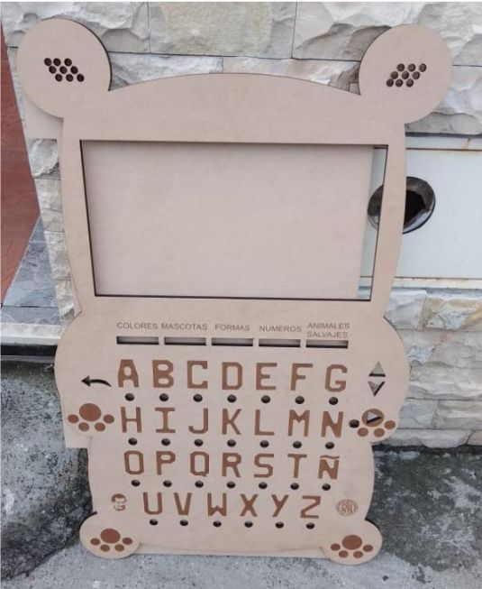
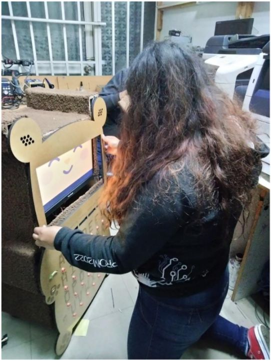

# MYABY Project

This project was a collaboration in the software side to build a device which is able to show different didactics for children about basic knowledge about English and Spanish language using videos, images and text.

The device is a Bear made of wood, it has a self-made keyboard, a card reader(MFRC522), a screen monitor, and a Raspberry Pi as a platform where all the software is executed.

<table>
    <tr>
        <td></td>
        <td></td>
    </tr>
</table>

In the program, there are 3 main didactics-features:

- **Observe:** Show a random video about tales.
- **Learn:** Show musical videos about basic concept of the language.
- **Interact:** Allow to read a card which is linked with a word, then the child can press the keys and introduce the letters corresponding to complete the word selected.

If you want to know more about how this project works, please have a look at my blog post.
- [MIABY Project - A Desktop Python Application using Kivy Framework](https://dev.to/nogyboy/miaby-project-a-desktop-python-application-using-kivy-framework-3h29)